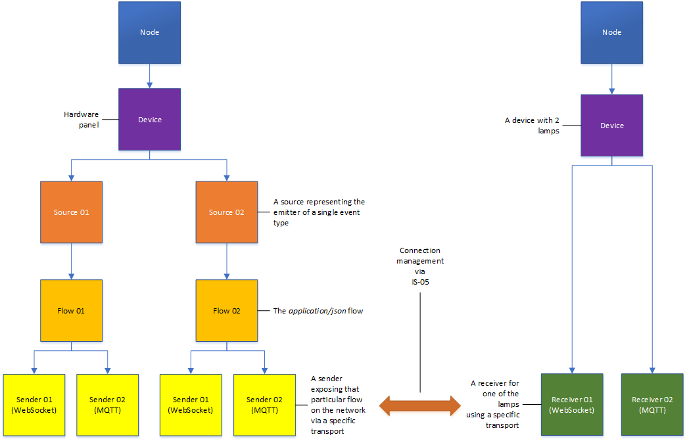

# Core models

This document specifies the core models and strategies employed.

The following transports will be supported:

* [MQTT](4.0%20MQTT_transport.md)
* [Websocket](5.0%20Websocket_transport.md)
* [AMQP](6.0%20AMQP_transport.md)

The specification relies heavily on existing IS-04 resources:

* nodes
* devices
* sources
* flows
* senders
* receivers

In the following sections we will discuss all of them in particular and mention any changes or aditions they might need in order to make the event and tally work possible.

In terms of relationships and workflows the following diagram shows an example:



The diagram does not aim to show any ownership but instead relationships and workflows. A source is the emitter of a particular type of event and plays a vital role in identity. A flow describes the event type for the grains contained.
A sender reflects the transport used to package a particular flow on to the network and a receiver is capable of receiving a set of event types using a particular transport.

## 1. Message structure

The message structure is split into the following sections:

* identity (mandatory)
* event_type (mandatory)
* timing (mandatory with some optional fields)
* payload (mandatory)

Message structure

```json
{
    "identity":
    {
        "source_id": "6cbd0441-7882-44cd-9557-842243a0d618",
        "flow_id": "c0d19bef-5547-4c03-8042-df95855abdab"
    },
    "event_type": "boolean",
    "timing":
    {
        "creation_timestamp": "",
        "origin_timestamp": "",
        "action_timestamp": ""
    },
    "payload":
    {
        "value": true
    }
}
```

The `"creation_timestamp"` represents the timestamp at which an event has been created (for sensors this is the acquisition time). This field is mandatory.  

The `"origin_timestamp"` represents the timestamp which led to the creation of an event due to external factors (a trigger). This field is optional.  

The `"action_timestamp"` represents the timestamp at which an event should be treated or result in an action (for synchronising and dealing with delays). This field is optional. 

The `"action_timestamp"` is not intended to be assocaited with delays of more than a few seconds, not for example to allow events scheduled in the future, 
it allows syncronisation of events in complex workflows.

The payload depends on the associated event_type (see [Event types](2.0%20Event_types.md)).

## 2. Nodes

There is no change or addition required from the IS-04 v1.2 schema.

## 3. Devices

There is no change or addition required from the IS-04 v1.2 schema but additional controls will be added to the `controls` array for Websocket transport and for the late joiners api (see [Websocket transport](5.0%20Websocket_transport.md) and [REST API (Late joiners)](7.0%20Rest_api_late_joiners.md)).

## 4. Sources

There is no change or addition required from the IS-04 v1.2 schema.
Event sources will use the `urn:x-nmos:format:data` format.

## 5. Flows

Event flows require a new string field called `event_type` in order to describe the event type emitted. Event flows will use the `urn:x-nmos:format:data` format and will have the media_type set to `application/json`.

Example:

```json
{
    "tags": {},
    "parents": [],
    "description": "Virtual Button 1",
    "format": "urn:x-nmos:format:data",
    "label": "Virtual Button 1",
    "id": "ff455cf3-fb17-448b-8f4c-e6c0e294f5ed",
    "source_id": "7b9d4864-5d6d-4227-a81d-8dd3e13e99b3",
    "version": "1529676926:000000000",
    "media_type": "application/json",
    "event_type": "boolean",
    "device_id": "58f6b536-ca4c-43fd-880a-9df2501fc125"
}
```

## 6. Senders

There is no change or addition required from the IS-04 v1.2 schema.

The supported transports will be extended to include:

* urn:x-nmos:transport:mqtt
* urn:x-nmos:transport:websocket
* urn:x-nmos:transport:amqp

The `manifest_href` will be overloaded to host a reference to the schema for the event type used by the associated flow.

Example:

```json
{
    "tags": {},
    "interface_bindings": [
        "eth0"
    ],
    "subscription": {
        "receiver_id": null,
        "active": false
    },
    "description": "Virtual Button 1",
    "transport": "urn:x-nmos:transport:mqtt",
    "label": "Virtual Button 1",
    "id": "68f519a3-5523-4b2c-b72d-ec23cc80207d",
    "device_id": "58f6b536-ca4c-43fd-880a-9df2501fc125",
    "flow_id": "0554b43a-ea7c-418d-a39e-1205ee281af3",
    "manifest_href": "http://hostname/x-nmos/events/v1.0/schemas/boolean",
    "version": "1529676926:000000000"
}
```

## 7. Receivers

Event receivers require a new array called `event_types` in order to list all of the event types they can consume (more details in [Event types](2.0%20Event_types.md)). Event receivers will use the `urn:x-nmos:format:data` format.

The supported transports will be extended to include:

* urn:x-nmos:transport:mqtt
* urn:x-nmos:transport:websocket
* urn:x-nmos:transport:amqp

Example:

```json
{
    "tags": {},
    "caps": {},
    "interface_bindings": [
        "eth0"
    ],
    "event_types": [
        "boolean"
    ],
    "description": "Virtual Lamp 1",
    "format": "urn:x-nmos:format:data",
    "transport": "urn:x-nmos:transport:mqtt",
    "label": "Virtual Lamp 1",
    "id": "8a7bb1c1-4a82-4fd9-a4fb-96f68f560831",
    "device_id": "58f6b536-ca4c-43fd-880a-9df2501fc125",
    "version": "1529676926:000000000",
    "subscription": {
        "sender_id": null,
        "active": false
    }
}
```

## 8. Connection management

Only use IS-05 connection management going forward.

Depending on the transport used different transport parameters need to be set in a `PATCH` request. The parameters will be detailed in each transport section.