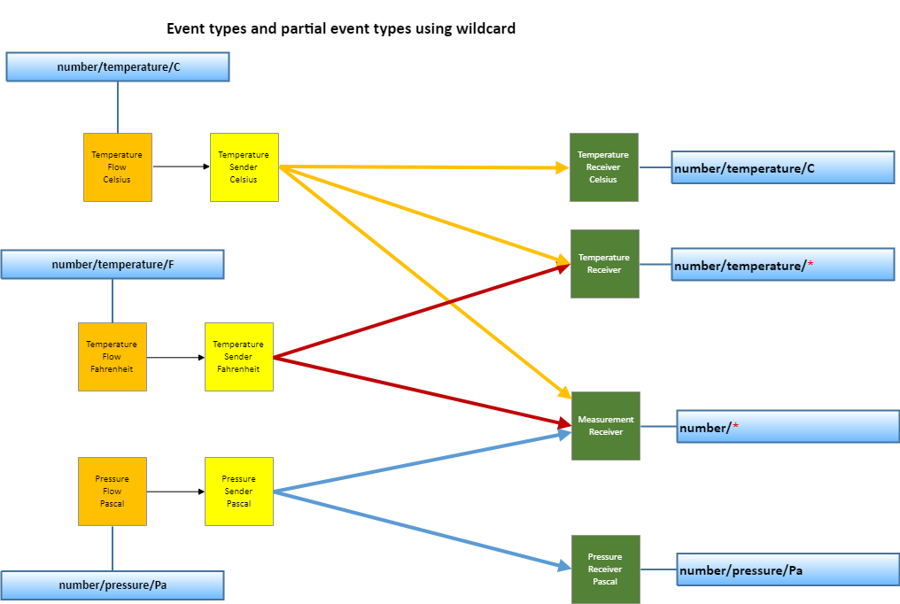

# Event types

_(c) AMWA 2018, CC Attribution-ShareAlike 4.0 International (CC BY-SA 4.0)_

This document specifies the supported event types and the strategies employed to define them.

Other sections can be accessed from the [Overview](1.0.%20Overview.md).

## 1. Introduction

These are the supported event types:

* boolean
* string
* number
* enum
* object (out of scope for version 1.0 of this specification)

The types are identified by the corresponding values in the `event_type` field in an event message and the NMOS source. When additional restrictions are applied to an event type, the *type definition object* is provided using the Events API (see [Events API](6.0.%20Event%20and%20tally%20rest%20api.md)). The type definition object always defines the type of the `value` field and can define restrictions on the value.

Comparisons between `event_type` values must be case sensitive.

## 2. Base types

The base type payloads always contain the `"value"` field and the type of the field in JSON corresponds to the base type.

### 2.1 boolean

The *boolean* event type is identified as `"boolean"` in the NMOS source.

#### _Example_:

A simple button indicating its condition as a boolean value (is the button pressed)

_Event Type_:
`boolean`

_Payload_:

```json
{
  "value": true
}
```

or

```json
{
  "value": false
}
```

_Type definition_:

```json
{
  "type": "boolean"
}
```

### 2.2 string

The *string* event type is identified as `"string"` in the NMOS source.

This event type is associated with a type definition object that is used to specify the following:

* minimum length (optional)
* maximum length (optional)
* pattern (regular expression) (optional)

#### _Example_:

A simple label on a button or on another UI element.

_Event Type_:
`string`

_Payload_:

```json
{
  "value": "my label"
}
```

_Type definition_:

```json
{
  "type": "string",
  "min_length": 1,
  "max_length": 30
}
```

### 2.3 number

The *number* event type is identified as `"number"` in the NMOS source.

In addition to the mandatory `value` field, an optional `scale` field is introduced to help carrying rational numbers without any loss of precision. In that case the `value` field represents the _numerator_ and the `scale` field represents the _denominator_ of the fraction.

This event type is associated with a type definition object that is used to specify the following:

* a `scale` field indicating the denominator typically used for rational numbers in the event payload (optional)
* minimum (inclusive) value (mandatory)
* maximum (inclusive) value (mandatory)
* step value (optional)
* measurement unit (optional)

The value of the optional `step` field indicates the precision.
When `step` is specified, the value of `max - min` should be an integer multiple of `step` (taking account the `value` and `scale` of each).
Similarly, for each event, `payload - min` should be an integer multiple of `step`.
The `scale` field of `min`, `max`, `step`, and each event `payload`, are typically the same.

Payload examples:

#### _Example_:

A simple 32-bit counter.

_Event Type_:
`number`

_Payload_:

```json
{
  "value": 16342
}
```

_Type definition_:

```json
{
  "type": "number",
  "min": {
    "value": 1
  },
  "max": {
    "value": 4294967295
  }
}
```

### 2.3.1 measurements

In the case where a unit of measure is specified for the number type, the event type is identified as `"number/{Name}/{Unit}"` in the NMOS source, where `{Name}` is the name of the measurement and `{Unit}` is the measurement unit, for example: `"number/temperature/C"`.

The definition of the units of measure is out of scope of this specification but the SI system of units is highly recommended.

The recommended strategy for naming measurement units can be read in the [Measurement units guidelines](7.0.%20Measurement%20units%20guidelines.md) section.

#### _Example_:

Temperature sensor with precision of 0.1°C

_Event Type_:
`number/temperature/C`

_Payload_:

```json
{
  "value": 201,
  "scale": 10
}
```

(_representing the value of 20.1°C_)

or

```json
{
  "value": 305,
  "scale": 10
}
```

(_representing the value of 30.5°C_)

_Type definition_:

```json
{
  "type": "number",
  "min": {
    "value": -200,
    "scale": 10
  },
  "max": {
    "value": 1000,
    "scale": 10
  },
  "step": {
    "value": 1,
    "scale": 10
  },
  "unit": "C"
}
```

#### _Example_:

Logarithmic fader reporting its position

_Event Type_:
`number/attenuation/dB`

_Payload_:

```json
{
  "value": 0
}
```

or

```json
{
  "value": -40
}
```

_Type definition_:

```json
{
  "type": "number",
  "min": {
    "value": -80
  },
  "max": {
    "value": 20
  },
  "step": {
    "value": 1
  },
  "unit": "dB"
}
```

## 3. enum

Enums can be defined on top of any of the three base types and provide both the list of allowed values and metadata that describe those values.

This event type is associated with a type definition object that is used to specify the following:

* a label for all the possible value options (mandatory)
* a description for all possible value options (mandatory)

The `enum` event type is identified as `"{base}/enum/{Name}"` in the NMOS source, where `{base}` is `boolean`, `string` or `number`, and `{Name}` is the name of the enum.

#### _Example_:
A numerical enum exposing the current studio usage and defining the button labels and description of the states.

_Event Type_:
`number/enum/StudioCondition`

_Payload_:

```json
{
  "value": 0
}
```

_Type definition_:

```json
{
  "type":  "number",
  "values": [
    {
      "value": 0,
      "label": "idle",
      "description": "Studio condition is idle"
    },
    {
      "value": 1,
      "label": "reh",
      "description": "Studio condition is rehearsal"
    },
    {
      "value": 2,
      "label": "tx",
      "description": "Studio condition is tx"
    }
  ]
}
```

#### _Example_:

An on/off switch with a bit of added metadata.

_Event Type_:
`boolean/enum/OnOff`

_Payload_:

```json
{
  "value": true
}
```

_Type definition_:

```json
{
  "type": "boolean",
  "values": [
    {
      "value": false,
      "label": "OFF",
      "description": "The device is off"
    },
    {
      "value": true,
      "label": "ON",
      "description": "The device is on"
    }
  ]
}
```

#### _Example_:

String based device status

_Event Type_:
`string/enum/DeviceStatus`

_Payload_:

```json
{
  "value": "ok"
}
```

_Type definition_:

```json
{
  "type": "string",
  "values": [
    {
      "value": "unknown",
      "label": "Device state is unknown",
      "description": "Device state is unknown. Check extension card is plugged in correctly."
    },
    {
      "value": "ok",
      "label": "Device state is ok",
      "description": "Device state is ok."
    },
    {
      "value": "warn",
      "label": "Device state is warning",
      "description": "Device state is warning. PSU 1 shows signs of failure."
    },
    {
      "value": "fail",
      "label": "Device state is fail",
      "description": "Device state is fail. No PTP reference found."
    }
  ]
}
```

## 4. object (out of scope for version 1.0 of this specification)

_The usage of the `object` event type is out of scope of this specification for version 1.0._

This event type will be associated with a type definition object that is used to specify the object structure. It will consist of fields that can have following types:

* other base types (boolean, string, number) or enum types
* other objects
* arrays of other base or enum types or objects

This definition will describe the payload types and metadata associated in detail. The available metadata for each field will be identical to the metadata defined for standalone types.

The `object` event type will be identified as `"object/{Name}"` in the NMOS source, where `{Name}` is the name of the object type.

## Event types capability management

Sources `"event_type"` field always needs to have an exact specific event type (cannot use wildcard).

Receivers `"event_types"` field can have a specific event type or may have a derived partial event type using a wildcard (`*`).

A wildcard (`*`) must replace a whole word and can only be used at the end of an event type definition.

More details about NMOS resources in the section [Core models](4.0.%20Core%20models.md).

The wildcard allows a smart receiver to advertise a wider capability with a specific category above. This is useful information when building a user interface which handles connection management but also matches capabilities between senders and receivers.

An example of a receiver which may use a wildcard could be a smart software gauge which can auto-calibrate. This could advertise its capability as `number/*`.

Another example could be for a temperature receiver which supports any measurement unit. This could advertise its capability as `number/temperature/*`.

A third example could be that of a temperature receiver which only supports degrees Celsius. It would advertise its capability as `number/temperature/C`.

The following examples are invalid uses for a wildcard:

* `number/tempera*`
* `number/*/C`


