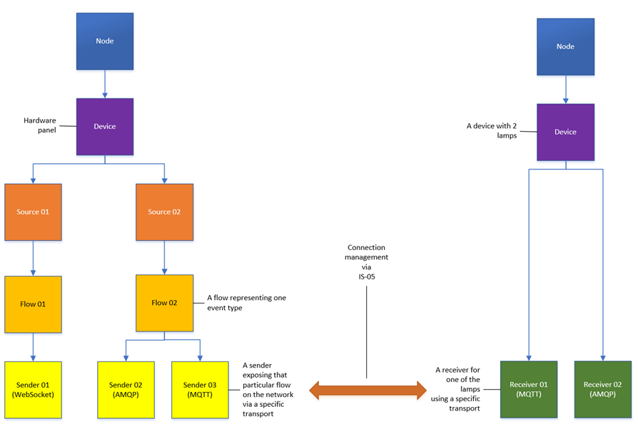

# Core models

_(c) AMWA 2018, CC Attribution-ShareAlike 4.0 International (CC BY-SA 4.0)_

This document specifies the core models and strategies employed.

Other sections can be accessed from the [Overview](1.0.%20Overview.md).

## 1. Introduction

The following transports are supported:

* [MQTT](5.1.%20Transport%20-%20MQTT.md)
* [Websocket](5.2.%20Transport%20-%20Websocket.md)

The v1.0 specification relies on the following existing specifications:

* IS-04 v1.3
* IS-05 v1.1

In terms of relationships and workflows the following diagram shows an example:



The diagram does not aim to show any ownership but instead relationships and workflows. A source is the emitter of a particular type of event and plays a vital role in identity. A flow describes the media type for the associated event_type. A sender reflects the transport used to package a particular flow on to the network and a receiver is capable of receiving a set of event types using a particular transport.

## 2. IS-04 highlights

### 2.1. Sources

Event sources have a new field called `event_type` in order to describe the event type emitted.
Event sources use the `urn:x-nmos:format:data` format.

Example:

```json
{
    "tags": {},
    "caps": {},
    "parents": [],
    "description": "Vision Mixer In 5 Active",
    "format": "urn:x-nmos:format:data",
    "label": "Vision Mixer In 5 Active",
    "id": "7a855001-0a87-4ce1-b490-b9d648cd6566",
    "device_id": "9ce6993a-db5f-47c9-babe-ee956945006d",
    "version": "1530806114:000000000",
    "clock_name": null,
    "event_type": "boolean"
}
```

### 2.2 Flows

Event flows use the `urn:x-nmos:format:data` format and have the media_type set to `application/json`.

Example:

```json
{
    "tags": {},
    "parents": [],
    "description": "Virtual Button 1",
    "format": "urn:x-nmos:format:data",
    "label": "Virtual Button 1",
    "id": "ff455cf3-fb17-448b-8f4c-e6c0e294f5ed",
    "source_id": "7b9d4864-5d6d-4227-a81d-8dd3e13e99b3",
    "version": "1529676926:000000000",
    "media_type": "application/json",
    "device_id": "58f6b536-ca4c-43fd-880a-9df2501fc125"
}
```

### 2.3 Senders

The supported transports have been extended to include:

* urn:x-nmos:transport:mqtt
* urn:x-nmos:transport:websocket

Example:

```json
{
    "tags": {},
    "interface_bindings": [
        "eth0"
    ],
    "subscription": {
        "receiver_id": null,
        "active": false
    },
    "description": "Virtual Button 1",
    "transport": "urn:x-nmos:transport:mqtt",
    "label": "Virtual Button 1",
    "id": "68f519a3-5523-4b2c-b72d-ec23cc80207d",
    "device_id": "58f6b536-ca4c-43fd-880a-9df2501fc125",
    "flow_id": "0554b43a-ea7c-418d-a39e-1205ee281af3",
    "manifest_href": "",
    "version": "1529676926:000000000"
}
```

### 2.4. Receivers

Event receivers have a new array called `event_types` inside the `caps` field in order to list all of the event types they can consume (more details in [Event types](3.0.%20Event%20types.md)).  
Event receivers use the `urn:x-nmos:format:data` format.

The supported transports have been extended to include:

* urn:x-nmos:transport:mqtt
* urn:x-nmos:transport:websocket

Example:

```json
{
    "tags": {},
    "caps": {
        "event_types": [
            "boolean"
        ]
    },
    "interface_bindings": [
        "eth0"
    ],
    "description": "Virtual Lamp 1",
    "format": "urn:x-nmos:format:data",
    "transport": "urn:x-nmos:transport:mqtt",
    "label": "Virtual Lamp 1",
    "id": "8a7bb1c1-4a82-4fd9-a4fb-96f68f560831",
    "device_id": "58f6b536-ca4c-43fd-880a-9df2501fc125",
    "version": "1529676926:000000000",
    "subscription": {
        "sender_id": null,
        "active": false
    }
}
```

## 3. NMOS Parameter Registers highlights

Event devices have an additional control in the `controls` array for the Event & Tally REST API (see [Event & Tally REST API](6.0.%20Event%20and%20tally%20rest%20api.md)).

The definition for this control is detailed with an entry in the NMOS Parameter Registers.

## 4. IS-05 highlights

### 4.1. MQTT sender transport parameters

The following transport parameters are exposed:

* destination_host (MQTT broker hostname or IP - defined in the IS-05 specification)
* destination_port (MQTT broker port - defined in the IS-05 specification)
* broker_topic (MQTT topic - defined in the IS-05 specification)
* connection_status_broker_topic (MQTT connection status topic - defined in the IS-05 specification)
* ext_is_07_rest_api_url (the event and tally rest api url targeting the associated source - defined in the IS-07 specification)

`ext_is_07_rest_api_url` schemas and examples are defined in IS-07 following the IS-05 templates.

### 4.2. Websocket sender transport parameters

The following transport parameters are exposed:

* connection_uri (The websocket server uri - defined in the IS-05 specification)
* ext_is_07_rest_api_url (the event and tally rest api url targeting the associated source - defined in the IS-07 specification)
* ext_is_07_source_id (the event source id used for filtering subscriptions - defined in the IS-07 specification)

`ext_is_07_rest_api_url` schemas and examples are defined in IS-07 following the IS-05 templates.
`ext_is_07_source_id` schemas and examples are defined in IS-07 following the IS-05 templates.

### 4.3. MQTT receiver transport parameters

The following transport parameters are exposed:

* source_host (MQTT broker hostname or IP - defined in the IS-05 specification)
* source_port (MQTT broker port - defined in the IS-05 specification)
* broker_topic (MQTT topic - defined in the IS-05 specification)
* connection_status_broker_topic (MQTT connection status topic - defined in the IS-05 specification)
* ext_is_07_rest_api_url (the event and tally rest api url targeting the associated source - defined in the IS-07 specification)

`ext_is_07_rest_api_url` schemas and examples are defined in IS-07 following the IS-05 templates.

### 4.4. Websocket receiver transport parameters

The following transport parameters are exposed:

* connection_uri (The websocket server uri - defined in the IS-05 specification)
* ext_is_07_rest_api_url (the event and tally rest api url targeting the associated source - defined in the IS-07 specification)
* ext_is_07_source_id (the event source id used for filtering subscriptions - defined in the IS-07 specification)

`ext_is_07_rest_api_url` schemas and examples are defined in IS-07 following the IS-05 templates.
`ext_is_07_source_id` schemas and examples are defined in IS-07 following the IS-05 templates.

### 4.5. Ext_ transport parameters

All of the `ext_` transport parameters mentioned in the previous sections follow the same templates as the IS-05 core parameters. They are supported by associated schemas, examples, constrains and staged/active entries. These are defined in the IS-07 specification as opposed to the core transport parameters defined in IS-05.

#### ext_is_07_rest_api_url

The `ext_is_07_rest_api_url` parameter represents the url to the API path which offers the current state and type of an event emitter (source) (see [Event & Tally REST API](6.0.%20Event%20and%20tally%20rest%20api.md))

It is important for the sender to always populate the `ext_is_07_rest_api_url` field using the following template:  
`{is_04_control_base_url}`sources/`{source_id_associated_with_sender}`/
The sender will populate `is_05_control_base_url` as being the href offered by the `urn:x-nmos:control:events/v1.0` control in the controls array of the sender device.  
The sender will populate `source_id_associated_with_sender` as being the unique ID of the source associated with the sender.  
For consistency the `ext_is_07_rest_api_url` url offered will always end with a trailing slash.

A receiver should always expect the `ext_is_07_rest_api_url` to follow the format above and only needs to append one of the following suffixes:

* state (to retrieve the current state of the emitter)
* type (to retrieve the metadata associated with the event_type of the emitter)

#### ext_is_07_source_id

The `ext_is_07_source_id` transport parameter represents the source id which is the emitter of the event. The sender will populate this with its associated source id.

### 4.6. Connection management

Event and tally connection management only supports IS-05 connection management (the legacy IS-04 connection management is not supported and deprecated).

This specification defines five new transport parameters to be used in a `PATCH` request:

* `broker_topic`
* `connection_status_broker_topic`
* `connection_uri`
* `ext_is_07_rest_api_url`
* `ext_is_07_source_id`

The usage will be detailed in each [transport](5.0.%20Transports.md) section and in the [Event & Tally REST API](6.0.%20Event%20and%20tally%20rest%20api.md) section.