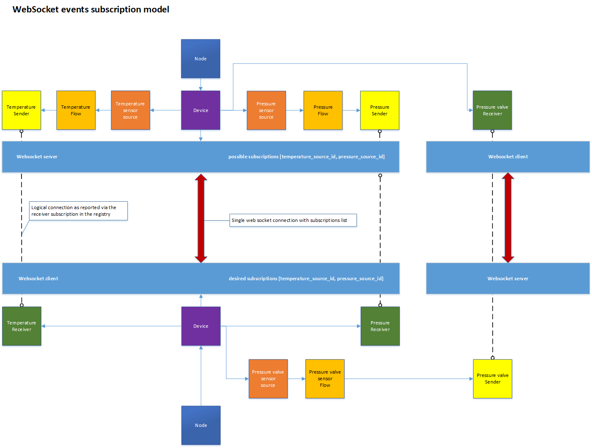

# Websocket Transport

Highlights:

* Brokerless
* Supports encryption
* Web app friendly
* Every sender device needs to run a server
* The problem of late joiners can be solved as the server can send initial states upon connection
* Events filtering needs to happen within the sender device

The NMOS Events & Tally community has shown interest in using the WebSocket protocol as a transport for events and tally information as it is a familiar protocol which has already been used in the NMOS ecosystem. 
There is an ongoing debate about WebSocket topologies being less efficient than broker based transport topologies (MQTT, AMQP) in a large-scale system because each sending device needs to host its own server to cope with demand. One of the cases we have identified which could be improved is when a device hosts multiple receivers which are interested in multiple senders on another device. In a simple receiver to sender connection mapping a connection would be required from each receiver to each sender. This could be improved with a device subscriptions model whereby you would only have a single connection between the devices with a subscriptions list. 



With that in mind, going forward you will see concepts such as server and client which represent the senders’ collection and the interested receivers’ collection.

Other sections can be accessed from the [Overview](1.0%20Overview.md).

## 1. NMOS Resources

The Websocket server will be hosted under an NMOS sender device in the `controls` array using the `urn:x-nmos:events:websocket` type.

Example

```json
{
    "senders": [
        "a65c15a4-a52e-4960-8cd2-e05c31196e5f",
        "68f519a3-5523-4b2c-b72d-ec23cc80207d"
    ],
    "receivers": [
        "8a7bb1c1-4a82-4fd9-a4fb-96f68f560831",
        "ab450c07-ce54-44da-9ea9-c3e62e7b06d0"
    ],
    "controls": [
        {
            "type": "urn:x-nmos:control:sr-ctrl/v1.0",
            "href": "http://hostname/x-nmos/connection/v1.0/"
        },
        {
            "href": "http://hostname/x-nmos/events/v1.0/",
            "type": "urn:x-nmos:events:query:states/v1.0/"
        },
        {
            "href": "ws://hostname/x-nmos/events/v1.0/transport/websocket/58f6b536-ca4c-43fd-880a-9df2501fa135",
            "type": "urn:x-nmos:events:websocket/v1.0"
        }
    ],
    "tags": {},
    "type": "urn:x-nmos:device:generic",
    "label": "Events Device",
    "version": "1529676926:000000000",
    "node_id": "d1713110-7343-4d9e-b3f4-456c8f6ce765",
    "id": "58f6b536-ca4c-43fd-880a-9df2501fc125",
    "description": "Events Engine Device"
}
```

NMOS resources using Websocket will use the `urn:x-nmos:transport:websocket` transport.

## 2. Connection management

Only use IS-05 connection management going forward.

For Websocket connections two new transport parameters need to exist:

* websocket_href
* late_joiners_url

### 2.1 websocket_href

The `websocket_href` parameter will be the url of the websocket server identified in the controls array of a device by the `urn:x-nmos:events:websocket` type.

### 2.2 late_joiners_url

The `late_joiners_url` parameter will represent the url to the API path which offers the current state of an event emitter (see [REST API (Late joiners)](7.0%20Rest_api_late_joiners.md))

Example of IS-05 PATCH request

```json
{
    "sender_id": "9f463872-9621-4939-aa3a-dc3c82d8578b",
    "master_enable": true,
    "activation": {
        "mode": "activate_immediate",
        "requested_time": null
    },
    "transport_params": [
        {
            "websocket_href": "ws://hostname/x-nmos/events/v1.0/transport/websocket/58f6b536-ca4c-43fd-880a-9df2501fa135",
            "late_joiners_url": "http://hostname/x-nmos/events/v1.0/senders/9f463872-9621-4939-aa3a-dc3c82d8578b/"
        }
    ]
}
```

## 3. Subscriptions strategy

Upon connection, a client needs to initialise its subscription list by sending a subscription command on the WebSocket channel. 

After establishing the subscription list, the client will start receiving events only for the items it has subscribed to. 
A client may choose to add or remove items to its subscription at any point in time. 

Each time a client updates its subscriptions list (sends a new subscription command), the server will resend all the current states for each of the subscribed senders. If a client needs to reconnect, then the WebSocket session context needs to be re-established so the client will send a new subscription command re-initialising its subscription. 

A subscription command will only get sent out as a consequence of an NMOS Connection Management action or a reconnection.

### 3.1 Heartbeats

Upon connection, the client is required to report its health every 60 seconds in order to maintain its session and subscription. This is similar to the behaviour required by the registry for nodes. 

Example health command

```json
{
  "command": "health",
  "value": "1441974485"
}
```

### 3.2 Connection logic flow

#### Step 1

The client connects to the `websocket_href` websocket session.

#### Step 2

The client establishes a subscriptions list by sending a `subscription` command.

Example

```json
{
  "command": "subscription",
  "senders": [
    "772116e0-b4ba-43b1-9ffc-70287c17cb9e",
    "674e32cb-84b5-475e-b7db-7821530c4375"
  ]
}
```

#### Step 3

The client receives the initial state for each sender in its subscription list thus solving the problem of late joiners.

#### Step 4

The client continues to receive events only from the subscribed senders.

#### Step 5

The client issues health commands every 60 seconds as described above.

## 4. Late joiners

As described above a client will receive the initial states for all the senders in its subscription list.

A client may also choose to query the late joiners api using `late_joiners_url` to access the latest state of an emitter in order to get in sync.