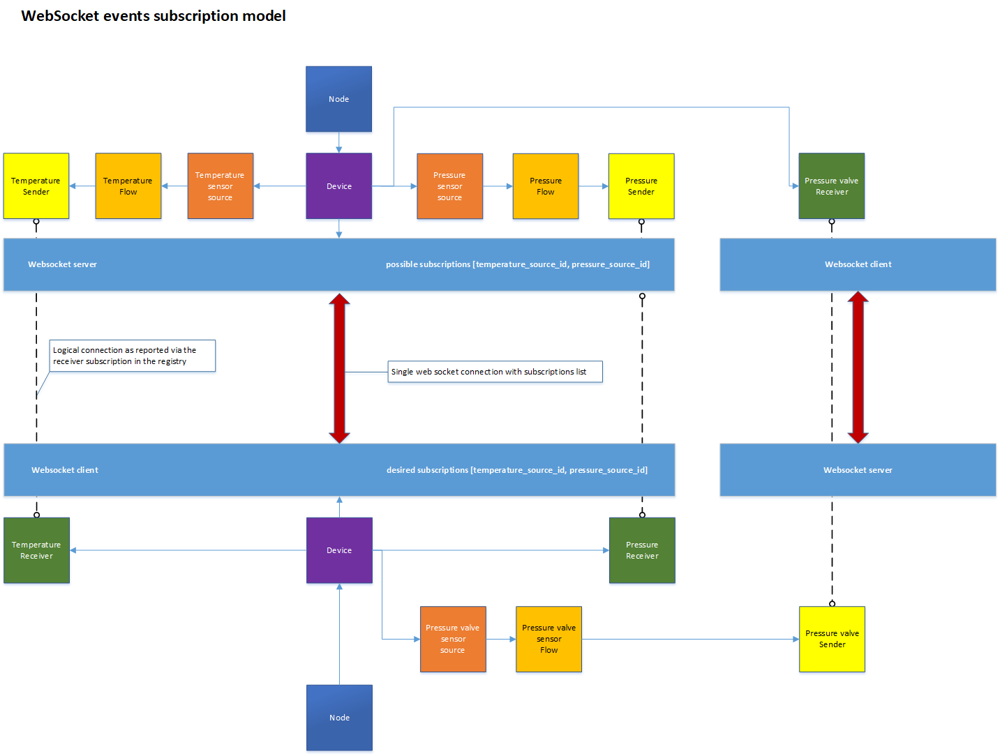

# Websocket Transport

_(c) AMWA 2018, CC Attribution-ShareAlike 4.0 International (CC BY-SA 4.0)_

This document describes the use of the WebSocket transport.

Other sections can be accessed from the [Overview](1.0.%20Overview.md).

## 1. Introduction

* Brokerless
* Supports encryption
* Web app friendly
* Every sender device needs to run a server
* The problem of late joiners can be solved as the server can send initial states upon connection
* Events filtering needs to happen within the sender device

The NMOS Events & Tally community has shown interest in using the WebSocket protocol as a transport for events and tally information as it is a familiar protocol which has already been used in the NMOS ecosystem.
There is an ongoing debate about WebSocket topologies being less efficient than broker based transport topologies like MQTT in a large-scale system because each sending device needs to host its own server to cope with demand. One of the cases we have identified which could be improved is when a device hosts multiple receivers which are interested in multiple senders on another device. In a simple receiver to sender connection mapping a connection would be required from each receiver to each sender. This could be improved with a device subscriptions model whereby you would only have a single connection between the devices with a subscriptions list.



With that in mind, going forward you will see concepts such as server and client which represent the senders’ collection and the interested receivers’ collection.

## 2. NMOS Resources

The Websocket server will be hosted under an NMOS sender device in the `controls` array using the `urn:x-nmos:events:websocket` type.

Example

```json
{
    "senders": [
        "a65c15a4-a52e-4960-8cd2-e05c31196e5f",
        "68f519a3-5523-4b2c-b72d-ec23cc80207d"
    ],
    "receivers": [
        "8a7bb1c1-4a82-4fd9-a4fb-96f68f560831",
        "ab450c07-ce54-44da-9ea9-c3e62e7b06d0"
    ],
    "controls": [
        {
            "type": "urn:x-nmos:control:sr-ctrl/v1.0",
            "href": "http://hostname/x-nmos/connection/v1.0/"
        },
        {
            "type": "urn:x-nmos:events:query/v1.0",
            "href": "http://hostname/x-nmos/events/v1.0/"
        },
        {
            "type": "urn:x-nmos:events:websocket/v1.0",
            "href": "ws://hostname/x-nmos/events/v1.0/device_id/58f6b536-ca4c-43fd-880a-9df2501fc125"
        }
    ],
    "tags": {},
    "type": "urn:x-nmos:device:generic",
    "label": "Events Device",
    "version": "1529676926:000000000",
    "node_id": "d1713110-7343-4d9e-b3f4-456c8f6ce765",
    "id": "58f6b536-ca4c-43fd-880a-9df2501fc125",
    "description": "Events Engine Device"
}
```

NMOS resources using Websocket will use the `urn:x-nmos:transport:websocket` transport.

## 3. Connection management

Only IS-05 connection management will be used for connection management of resources defined in this specification.

### 3.1 websocket_url

The `websocket_url` parameter will be the url of the websocket server identified in the controls array of a device by the `urn:x-nmos:events:websocket` type.

### 3.2 rest_api_url

The `rest_api_url` parameter will represent the url to the API path which offers the current state and type of an event emitter (source) (see [Event & Tally REST API](6.0.%20Event_and_tally_rest_api.md))

It is important for the controller to always populate the `rest_api_url` field using the following template:  
`{is_05_control_base_url}`sources/`{source_id_associated_with_sender}`/  
The controller will populate `is_05_control_base_url` as being the href offered by the `urn:x-nmos:events:query/v1.0` control in the controls array of the sender device.  
The controller will populate `source_id_associated_with_sender` as being the unique ID of the source associated with the sender.  
For consistency the `rest_api_url` url offered will always end with a trailing slash.

A receiver should always expect the `rest_api_url` to follow the format above and only needs to append one of the following suffixes:

* state (to retrieve the current state of the emitter)
* type (to retrieve the metadata associated with the event_type of the emitter)

_Example of IS-05 PATCH request_

```json
{
    "sender_id": "9f463872-9621-4939-aa3a-dc3c82d8578b",
    "master_enable": true,
    "activation": {
        "mode": "activate_immediate",
        "requested_time": null
    },
    "transport_params": [
        {
            "websocket_url": "ws://hostname/x-nmos/events/v1.0/device_id/58f6b536-ca4c-43fd-880a-9df2501fc125",
            "rest_api_url": "http://hostname/x-nmos/events/v1.0/sources/9f463872-9621-4939-aa3a-dc3c82d8578b/"
        }
    ]
}
```

## 4. Subscriptions strategy

Upon connection, a client needs to initialise its subscription list by sending a subscription command on the WebSocket channel.

After establishing the subscription list, the client will start receiving events only for the items it has subscribed to.
A client may choose to add or remove items to its subscription at any point in time.

Each time a client updates its subscriptions list (sends a new subscription command), the server will resend all the current states for each of the subscribed sources. If a client needs to reconnect, then the WebSocket session context needs to be re-established so the client will send a new subscription command re-initialising its subscription.

A subscription command will only get sent out as a consequence of an NMOS Connection Management action or a reconnection.

### 4.1 Heartbeats

Upon connection, the client is required to report its health every 5 seconds in order to maintain its session and subscription. This is similar to the behaviour required by the registry for nodes in IS-04 specification. Every `health` command should be followed by a `health` response (see [Message types](2.0.%20Message_types.md)).  
The server is expected to check `health` commands and after 2 consecutive missed `health` commands it should clear the subscriptions for that particular client and close the websocket connection. The server is also required to respond to a heartbeat within 5 seconds of receiving the `health` command.

Example health command

```json
{
  "command": "health",
  "timestamp": "1441974485:12300000"
}
```

Example health response

```json
{  
  "timing":{
    "origin_timestamp": "1441974485:12300000",
    "creation_timestamp": "1441974485:23400000"
  },
  "message_type": "health"
}
```

### 4.2 Connection logic flow

#### Step 1

The client connects to the `websocket_href` websocket session.

#### Step 2

The client establishes a subscriptions list by sending a `subscription` command.

Example

```json
{
  "command": "subscription",
  "sources": [
    "772116e0-b4ba-43b1-9ffc-70287c17cb9e",
    "674e32cb-84b5-475e-b7db-7821530c4375"
  ]
}
```

#### Step 3

The client receives the initial state for each source in its subscription list thus solving the problem of late joiners.

#### Step 4

The client continues to receive events only from the subscribed sources.

#### Step 5

The client issues health commands every 5 seconds as described above.

## 5. Late joiners

As described above a client will receive the initial states for all the sources in its subscription list.

A client may also choose to query the Event & Tally REST API using `rest_api_url` to access the latest state of an emitter in order to verify the current state.
